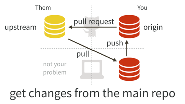
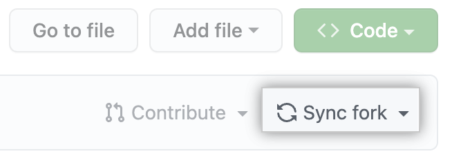
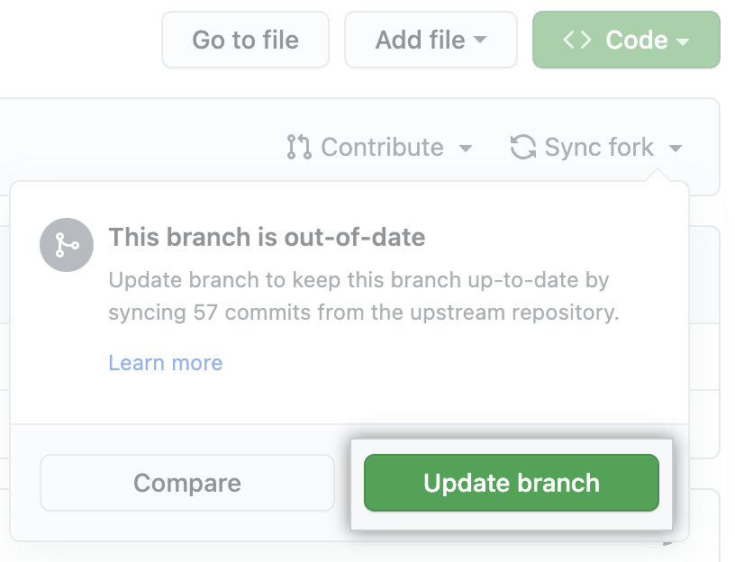
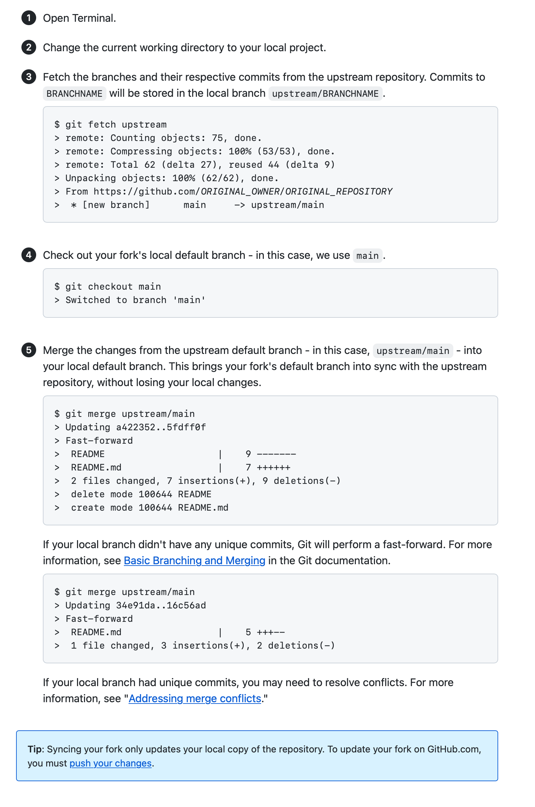

# Dev Meeting Introduction to The GitHub Workflow

|   | `url` | Note | 
| - | -     | -    
| `upstream` | [`https://github.com/kelechiP/dev-meeting.git`](https://github.com/kelechiP/dev-meeting.git) | Original repository that is usuallyl [forked](https://docs.github.com/en/get-started/quickstart/fork-a-repo)|
| `origin` | [`https://github.com/knwachuk/dev-meeting.git`](https://github.com/knwachuk/dev-meeting.git) | [Cloned](https://docs.github.com/en/repositories/creating-and-managing-repositories/cloning-a-repository) repository |

1. [Introduction](#introduction)
2. [Following GitHub Flow](#)

## Introduction <a name="introduction"></a>

The purpose of this repository is the introduction to working in **[The GitHub Workflow](https://docs.github.com/en/get-started/quickstart/github-flow)**. In a nutshell, the GitHub flow is a leightweight, branch-based workflow.

### Prerequisites

To follow GitHub flow, you will need a GitHub account and a repository. For information on how to create an account, see "[Signing up for GitHub](https://docs.github.com/en/github/getting-started-with-github/signing-up-for-github)". For information on how to create a repository, see "[Create a repo](https://docs.github.com/en/github/getting-started-with-github/create-a-repo)".

## Following GitHub Flow <a name="introduction"></a>


1. Create a branch
2. Make changes
3. Create a pull request
4. Address review comments
5. Merge your pull request
6. Delete your branch

## GitHub Command <a name="introduction"></a>

### Git Data Transport with `origin`


**Source**: [https://blog.osteele.com/2008/05/my-git-workflow/](https://blog.osteele.com/2008/05/my-git-workflow/)

### Git Data Transport with `upstream`



**Source**: [https://happygitwithr.com/upstream-changes.html](https://happygitwithr.com/upstream-changes.html)


## [Synching a Fork](https://docs.github.com/en/pull-requests/collaborating-with-pull-requests/working-with-forks/syncing-a-fork) <a name="introduction"></a>

Sync a fork of a repository to keit it up-to-date with the `upstream` repository.

> Who cna use this feature
> People with write access for a forked repository can sync the fork to the `upstream` repository

### Synching a fork branch from the web UI

1. On GitHub, navigate to the main page of the forked repository that you want to sync with the upstream repository.
2. Select the **Sync fork** dropdown.



3. Review the detaisl about the commits from the upstream repository, then click **Update branch**.



### Synching a fork branch from the command line

> Before you can sync a fork with an upstream repository, you must [configure a remote that points to the upstream repository](https://docs.github.com/en/pull-requests/collaborating-with-pull-requests/working-with-forks/configuring-a-remote-for-a-fork) in Git.
>
> ```unix
> git remote add upstream https://github.com/ORIGINAL_OWNER/ORIGINAL_REPOSITORY.git
> ```


